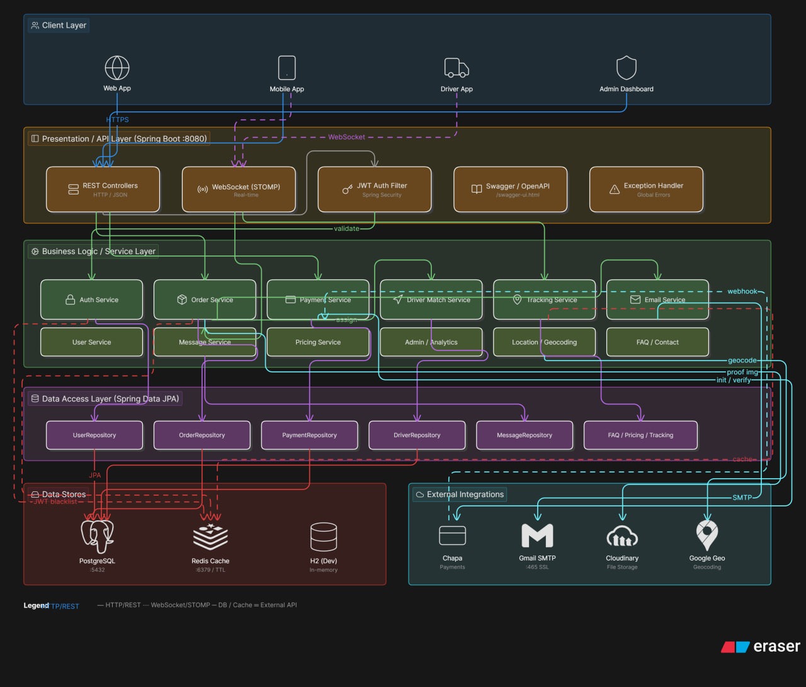

# 🚚 Delivery Management System — Backend API

> **Production-ready Spring Boot backend** for end-to-end delivery operations — featuring WebSocket real-time driver tracking, Chapa payment integration, multi-role JWT security, and a full analytics dashboard.

<p align="center">
  
  
  
  
  
  
  
</p>

---

## What This System Does

This API powers a full delivery platform — customers place and pay for orders, drivers receive assignments and update locations in real time, and admins manage the entire operation from a single dashboard.

**Three roles. One coherent system.**

| Role | Key Capabilities |
|------|-----------------|
| 👤 **Customer** | Register, order, pay via Chapa, track live delivery, message driver |
| 🚗 **Driver** | Receive assignments, update real-time location, upload delivery proof |
| 🛡️ **Admin** | Manage users/drivers, assign orders by location, view analytics |

---

## Architecture



The system is built across four clean layers:

- **Client Layer** — Web, Mobile, Driver App, Admin Dashboard (HTTPS + WebSocket)
- **API Layer** — REST Controllers, WebSocket/STOMP, JWT Auth Filter, Swagger, Global Error Handler
- **Service Layer** — 12 domain services: Auth, Order, Payment, Driver Matching, Tracking, Email, Pricing, Messaging, Location/Geocoding, Analytics, FAQ, User
- **Data Layer** — Spring Data JPA repositories → PostgreSQL (prod) / H2 (dev), Redis cache, JWT blacklist

**External integrations:** Chapa (payments), Gmail SMTP (email), Cloudinary (file storage), Google Geocoding API (location)

---

## Key Technical Highlights

### ⚡ Real-Time Driver Tracking
WebSocket with STOMP protocol — customers subscribe to their order topic and receive live driver location updates as the driver moves. No polling. No refresh.

### 💳 Payment Integration (Chapa)
Full payment lifecycle: initialize → redirect → webhook verification (HMAC-SHA256 signature) → order status update. Supports sandbox and production modes.

### 🔐 Role-Based Security
Spring Security + JWT with three roles (CUSTOMER, DRIVER, ADMIN). Token blacklisting on logout. Email verification on registration. BCrypt password hashing. All endpoints protected by role scope.

### 📍 Smart Driver Assignment
Admin assigns drivers based on proximity using Google Geocoding API. Driver location is tracked continuously via WebSocket and stored for dispatch decisions.

### 🗄️ Redis Caching + Session Management
Redis caches frequent queries and manages JWT blacklist for stateless logout. Configurable TTL per cache key.

---

## Technology Stack

| Layer | Technology |
|-------|-----------|
| Framework | Spring Boot 3.5.7 |
| Language | Java 21 |
| Build | Maven |
| Security | Spring Security + JWT |
| Real-time | WebSocket (STOMP) |
| ORM | Spring Data JPA / Hibernate |
| Database (prod) | PostgreSQL 12+ |
| Database (dev) | H2 In-memory |
| Cache | Redis 6.0+ |
| Payment | Chapa API |
| File Storage | Cloudinary |
| Email | Gmail SMTP (SSL :465) |
| Geocoding | Google Geo API |
| API Docs | SpringDoc OpenAPI (Swagger) |

---

## Getting Started

### Prerequisites

- Java 21+
- Maven 3.6+
- Redis 6.0+
- PostgreSQL 12+ *(production only — H2 used in dev)*

### Installation

```bash
# 1. Clone the repository
git clone https://github.com/Yobil-Job/delivery.git
cd delivery

# 2. Copy environment config
cp .env.example .env

# 3. Fill in your environment variables (see below)

# 4. Start Redis
redis-server

# 5. Run the application
mvn spring-boot:run
```

API available at: `http://localhost:8080`
Swagger UI: `http://localhost:8080/swagger-ui.html`

---

## Environment Variables

Create a `.env` file in the project root:

```env
# ── JWT ────────────────────────────────────────────
JWT_SECRET=your-secret-key-minimum-32-characters
JWT_EXPIRATION=1800000
JWT_REFRESH_EXPIRATION=604800000

# ── Database ───────────────────────────────────────
SPRING_DATASOURCE_URL=jdbc:postgresql://localhost:5432/delivery_db
SPRING_DATASOURCE_USERNAME=your_db_user
SPRING_DATASOURCE_PASSWORD=your_db_password

# ── Redis ──────────────────────────────────────────
REDIS_HOST=localhost
REDIS_PORT=6379
REDIS_PASSWORD=
REDIS_SSL_ENABLED=false

# ── Email (Gmail SMTP) ─────────────────────────────
MAIL_HOST=smtp.gmail.com
MAIL_PORT=465
MAIL_USERNAME=your-email@gmail.com
MAIL_PASSWORD=your-app-password
MAIL_FROM=noreply@yourdomain.com

# ── Chapa Payment ──────────────────────────────────
CHAPA_SECRET=your-chapa-secret-key
CHAPA_PUBLIC=your-chapa-public-key
CHAPA_MODE=SANDBOX
CHAPA_BASE_URL=https://api.chapa.co/v1
PAYMENT_RETURN_URL=http://localhost:3000/payments/result
PAYMENT_NOTIFY_URL=http://localhost:8080/api/payments/webhook

# ── Cloudinary ─────────────────────────────────────
CLOUDINARY_CLOUD_NAME=your-cloud-name
CLOUDINARY_API_KEY=your-api-key
CLOUDINARY_API_SECRET=your-api-secret

# ── CORS ───────────────────────────────────────────
CORS_ALLOWED_ORIGINS=http://localhost:3000,http://localhost:5173
```

---

## API Reference

Full interactive docs at `/swagger-ui.html`. Core endpoints:

### Authentication
```
POST   /api/auth/register          Register new user
POST   /api/auth/login             Login → returns JWT
POST   /api/auth/refresh           Refresh access token
POST   /api/auth/logout            Invalidate token (Redis blacklist)
POST   /api/auth/verify-email      Verify email after registration
POST   /api/auth/forgot-password   Request password reset
POST   /api/auth/reset-password    Complete password reset
```

### Orders
```
POST   /api/orders                         Create order
GET    /api/orders/my                      Get my orders
GET    /api/orders/{orderNumber}           Order details
PATCH  /api/orders/{orderNumber}/cancel    Cancel order
GET    /api/orders/track/{orderNumber}     Public tracking (no auth)
```

### Payments
```
POST   /api/payments/initialize    Start Chapa payment flow
POST   /api/payments/verify        Verify payment status
POST   /api/payments/webhook       Chapa webhook receiver
```

### Admin
```
GET/POST/PATCH/DELETE   /api/admin/**    Full admin CRUD (ADMIN role required)
```

---

## Project Structure

```
delivery/
├── src/main/java/com/kuru/delivery/
│   ├── auth/              # JWT, Spring Security, email verification
│   ├── user/              # User management & profiles
│   ├── order/             # Order lifecycle management
│   ├── payment/           # Chapa integration & webhook handler
│   ├── driver/            # Driver profiles & assignment logic
│   ├── location/          # Google Geocoding & live tracking
│   ├── message/           # Customer ↔ Driver messaging
│   ├── pricing/           # Dynamic pricing rules
│   ├── admin/             # Admin dashboard & analytics
│   ├── faq/               # FAQ management
│   ├── contact/           # Contact form
│   ├── config/            # Security, Redis, WebSocket, CORS config
│   └── common/            # Shared DTOs, exceptions, utilities
└── src/main/resources/
    └── application.properties
```

---

## Security Design

```
Request → JWT Auth Filter → Role Check → Controller → Service
                                ↓
                         Redis blacklist check (logout)
```

| Concern | Implementation |
|---------|---------------|
| Authentication | Stateless JWT (access + refresh tokens) |
| Authorization | Spring Security RBAC — CUSTOMER / DRIVER / ADMIN |
| Logout | Token blacklisted in Redis with TTL |
| Passwords | BCrypt hashing |
| Payment integrity | HMAC-SHA256 webhook signature verification |
| File uploads | Magic byte validation + path traversal prevention |
| API exposure | CORS whitelist, input validation, SQL injection prevention via JPA |

---

## Running in Production

```bash
# Build
mvn clean package -DskipTests

# Run
java -jar target/delivery-0.0.1-SNAPSHOT.jar
```

**Production checklist:**
- [ ] Set `CHAPA_MODE=PRODUCTION`
- [ ] Configure PostgreSQL connection
- [ ] Set up Redis with password
- [ ] Configure SSL/TLS termination
- [ ] Update `CORS_ALLOWED_ORIGINS` to your domain
- [ ] Set `TRUST_PROXY=true` if behind a reverse proxy

**Recommended platforms:** Render (free PostgreSQL + Redis), Railway, DigitalOcean, AWS (EC2 + RDS + ElastiCache)

---

## Common Issues

| Issue | Fix |
|-------|-----|
| App won't start | Check `.env` file exists and Redis is running |
| Payment fails | Verify `CHAPA_SECRET` and confirm `CHAPA_MODE` is correct |
| Email not sending | Use a Gmail **App Password**, not your account password |
| WebSocket drops | Check `CORS_ALLOWED_ORIGINS` includes your frontend URL |
| JWT invalid after restart | Ensure `JWT_SECRET` is consistent across restarts |

---

## Author

**Eyob Weldetensay**
Spring Boot Backend Developer · Spring AI · REST APIs · Real-time Systems

[](https://github.com/Yobil-Job)

---

*Built with Spring Boot 3.5.7 · Java 21 · Chapa · WebSocket · Redis*
